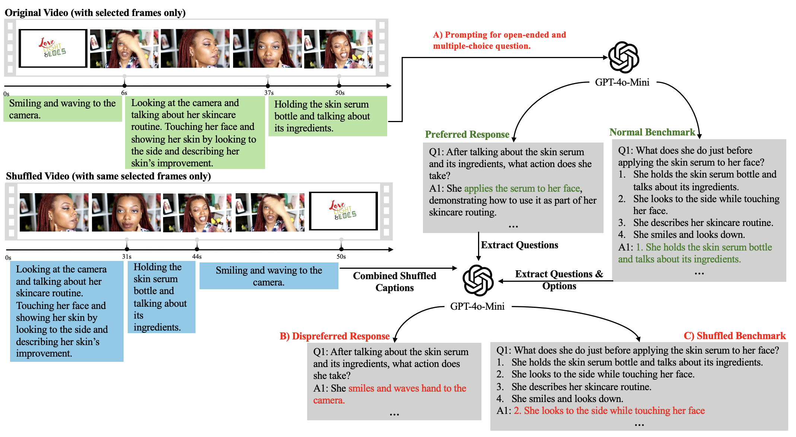

# Harnessing Synthetic Preference Data for Enhancing Temporal Understanding of Video-LLMs



This repository will provide access to the dataset, pretrained checkpoints, inference, and the training code for our paper, TimeWarp. We provide our training scripts with modified versions taking from [LLaVA-Hound](https://github.com/RifleZhang/LLaVA-Hound-DPO) as the backbone for easy reproducibility.

# TODOs:
- [ ] Release timewarp data generation script
- [ ] Release checkpoints for LLaVA-Hound and Video-LLaMA3
- [ ] Release training, evaluation, and inference code
- [ ] Replace citation and links with the original one

# Checkpoints

| Methods                     | LLaVA-Hound | Video-LLaMA3 |
|-----------------------------|-------------|--------------|
| SFT                         | [Link](#)   | [Link](#)    |
| Base-DPO                    | [Link](#)   | [Link](#)    |
| Combined (ours)             | [Link](#)   | [Link](#)    |
| TimeWarp-Implicit (ours)    | [Link](#)   | [Link](#)    |
| TimeWarp-Explicit (ours)    | [Link](#)   | [Link](#)    |

# Citing
If you find TimeWarp useful, consider citing:
```bibtex
@article{patel2024tripletclip,
    author = {Patel, Maitreya and Kusumba, Abhiram and Cheng, Sheng and Kim, Changhoon and Gokhale, Tejas and Baral, Chitta and Yang, Yezhou},
    title = {TripletCLIP: Improving Compositional Reasoning of CLIP via Synthetic Vision-Language Negatives},
    journal={Advances in neural information processing systems},
    year = {2024},
}
```